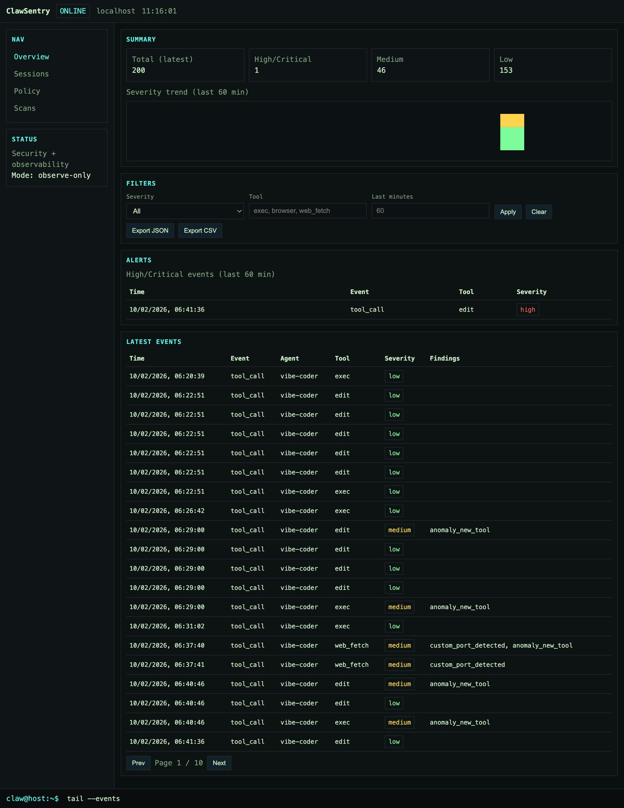

# ClawSentry

Security + observability plugin for **OpenClaw** with scans, policy rules, and monitoring.

## Features
- Observe‑only by default (blocking only when explicitly enabled)
- Web UI (mobile‑friendly, multi‑page)
- Scans: pre‑install skill, workspace skill, full system scan
- Alerts (UI‑only): high/critical findings table
- Policy engine: deny/allow tools and findings, optional enforcement
- Telemetry: tool usage logs, anomaly detection
- Optional monitors: process + network

## Screenshot


## Use Cases
- **Audit agent behavior** during tool calls and detect risky patterns
- **Pre‑install checks** for skills before enabling them
- **Continuous visibility** into execution anomalies and large payloads
- **Policy dry‑runs** before enabling enforcement
- **Incident review** via stored logs and scan results

## Install
Copy the plugin to your OpenClaw extensions folder:

```bash
cp -R . ~/.openclaw/extensions/clawsentry
```

Enable in `openclaw.json`:

```json
{
  "plugins": {
    "entries": {
      "clawsentry": {
        "enabled": true,
        "config": {
          "logDir": "~/.openclaw/clawsentry/logs",
          "redact": true,
          "maxPayloadBytes": 4096,
          "policy": { "denyTools": [], "allowTools": [], "denyFindings": [], "enforce": false },
          "processMonitor": { "enabled": false, "intervalSec": 60 },
          "networkMonitor": { "enabled": false, "intervalSec": 60 },
          "anomaly": { "enabled": true, "largePayloadBytes": 20000 },
          "alerts": { "enabled": true }
        }
      }
    }
  }
}
```

Restart OpenClaw:

```bash
openclaw gateway restart
```

Open the UI:
```
http://localhost:3000/clawsentry
```

## Repo Layout
```
index.ts
openclaw.plugin.json
src/clawsentry.ts
```

## Notes
- Alerts are UI‑only (no system/chat notifications).
- Last scan results are always shown on the Scans page.
